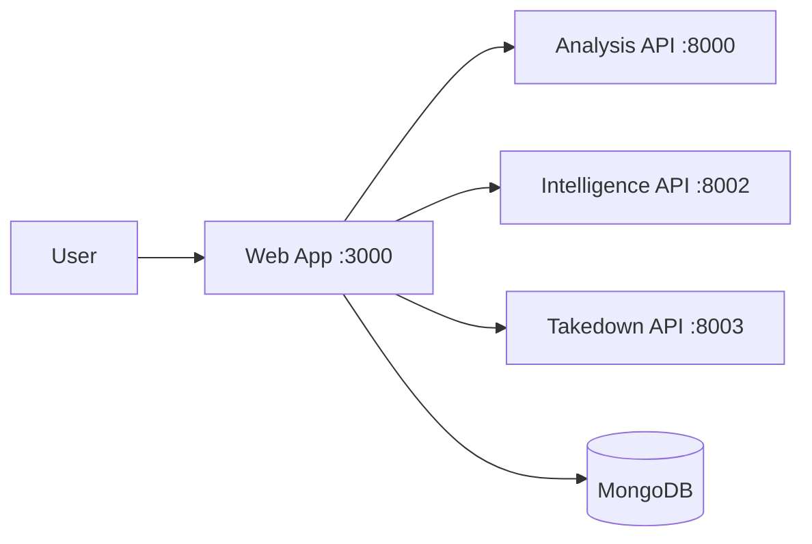

# Impic AlgoForge 26 (monorepo)

Hackathon monorepo containing the full **Sniffer**-derived stack: Next.js web app (`@sniffer/web`) and three FastAPI services. Product rebranding and UX work can proceed on top of this base.

Upstream-style overview:

Monorepo for image authenticity analysis, domain intelligence lookup, and takedown guidance.

Detailed version: [detail.md](detail.md)

## Overview

Main flow:

1. Create a case.
2. Upload suspicious image (and optional reference image).
3. Run analysis.
4. Query intelligence and takedown services.
5. View report and dashboard data.

## Services

- Web app: Next.js app, auth, UI, API proxy routes
- Analysis service: FastAPI service for case, analysis, discovery, and registry
- Intelligence service: FastAPI domain/provider/network lookup
- Takedown service: FastAPI removal guidance lookup and scrape fallback

## Architecture



## Tech Stack

- Frontend: Next.js 16, React 19, TypeScript, Tailwind CSS
- Backend: Python 3.11+, FastAPI, Uvicorn, Pydantic
- Data: MongoDB + CSV datasets
- Tooling: pnpm workspaces

## Repository Layout

```text
apps/web/                 Next.js frontend + API routes + auth + dashboard
services/analysis/        FastAPI analysis service
services/intelligence/    FastAPI intelligence service
services/takedown/        FastAPI takedown service
```

## API Endpoints

### Analysis Service (`:8000`)

- POST `/api/cases/`
- GET `/api/cases/{case_id}`
- POST `/api/analysis/{case_id}/run`
- GET `/api/analysis/{case_id}/result`
- POST `/api/analysis/{case_id}/discover`
- GET `/api/analysis/{case_id}/discover`
- POST `/api/registry/`
- GET `/api/registry/`
- GET `/api/registry/check/{file_hash}`
- POST `/api/registry/takedown-notice`
- GET `/api/dashboard/`
- GET `/health`

### Intelligence Service (`:8002`)

- GET `/api/v1/intelligence/{domain}`
- GET `/api/v1/intelligence/`
- GET `/health`

### Takedown Service (`:8003`)

- GET `/api/v1/takedown/{domain}`
- GET `/api/v1/takedown/`
- GET `/health`

### Web API Routes

- `/api/cases/*`
- `/api/intelligence/[domain]`
- `/api/takedown/[domain]`
- `/api/user/cases`
- `/api/dashboard/overview`

## Local Setup

Prerequisites:

- Node.js 20+
- pnpm 9+
- Python 3.11+

Install Node dependencies and create a **shared** Python virtualenv used by pnpm scripts (path: `services/.venv`):

```bash
pnpm install

cd services
python -m venv .venv

# Windows
.venv\Scripts\activate

# macOS/Linux
source .venv/bin/activate

pip install -r analysis/requirements.txt
pip install -r intelligence/requirements.txt
pip install -r takedown/requirements.txt
cd ..

pnpm dev
```

Alternatively, from repo root: `pnpm install:py` after `services/.venv` exists and dependencies are installed once.

Expected local ports:

- Web: `3000`
- Analysis: `8000`
- Intelligence: `8002`
- Takedown: `8003`

## Environment Variables

Copy `apps/web/.env.example` to `apps/web/.env.local` for local development.

### Web (`apps/web/.env.local`)

Required:

- `MONGODB_URI`
- `NEXT_PUBLIC_API_URL`
- `INTELLIGENCE_SERVICE_URL`
- `TAKEDOWN_SERVICE_URL`

Optional (email auth):

- `EMAIL_SERVER_HOST`
- `EMAIL_SERVER_PORT`
- `EMAIL_SERVER_USER`
- `EMAIL_SERVER_PASSWORD`
- `EMAIL_FROM`
- `NEXTAUTH_URL`
- `NEXTAUTH_SECRET`

`apps/web/.env.production` contains **non-secret placeholders** so `pnpm build` succeeds without a local file; override with `.env.production.local` in real deployments.

### Analysis (`services/analysis/.env`)

- `HF_TOKEN` (optional, model-dependent) — see `services/analysis/.env.example`

### Intelligence (`services/intelligence/.env`)

- `INTELLIGENCE_PORT` (optional)
- `ALLOWED_ORIGINS` (recommended)
- `INTELLIGENCE_DATA_PATH` (optional)

### Takedown (`services/takedown/.env`)

- `TAKEDOWN_PORT` (optional)
- `ALLOWED_ORIGINS` (recommended)
- `TAKEDOWN_DATA_PATH` (optional)
- `SCRAPE_TIMEOUT` (optional)
